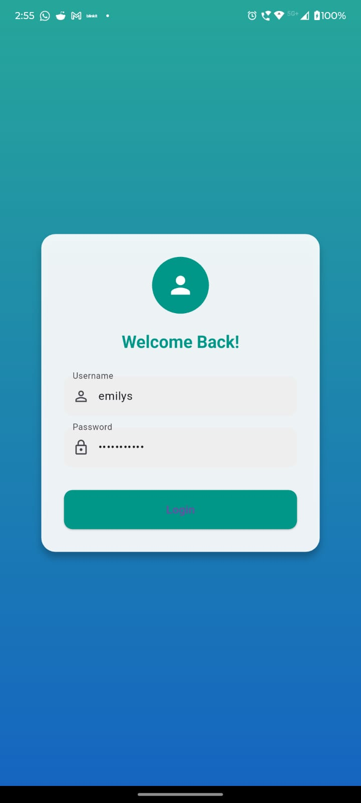
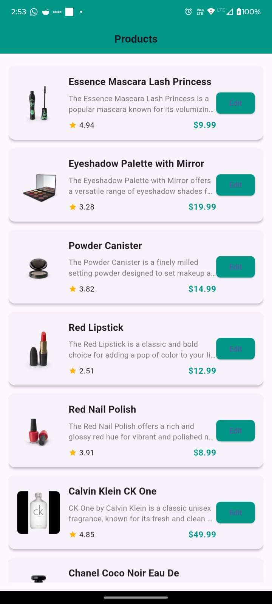

<!DOCTYPE html>
<html lang="en">

<body>
    <h1>Flutter App - Kings Lab Machine Test</h1>
    
This Flutter application demonstrates authentication and product management using Riverpod, Dio, and Dummy APIs.

  <h2>1. Login Screen</h2>
    
The app provides a login screen where users can enter their credentials:

    <ul>
        <li><strong>Username:</strong> emilys</li>
        <li><strong>Password:</strong> emilysspass</li>
    </ul>
  
When the login button is clicked, the app makes a POST request to:

    <pre><code>https://dummyjson.com/auth/</code></pre>
    
If the login is successful, the user is navigated to the Home Page displaying user details. If authentication fails, an error message is shown using a toast notification.

    

  <h2>2. Home Page</h2>
    
The home page fetches product data from:

    <pre><code>https://dummyjson.com/products</code></pre>
    
It displays a list of products along with an Edit button for each item.

    
Clicking the Edit button navigates the user to the Product Page.

    

 <h2>3. Product Page</h2>
    
The product page retrieves details for a selected product using:

    <pre><code>https://dummyjson.com/product/{product_id}</code></pre>
    
Users can update product information on this page.

    

  <h2>Technologies Used</h2>
   <ul>
        <li><strong>Flutter</strong> - UI framework</li>
        <li><strong>Riverpod</strong> - State management</li>
        <li><strong>Dio</strong> - HTTP client for API calls</li>
        <li><strong>DummyJSON API</strong> - Fake backend data</li>
    </ul>

<h2>Download APK</h2>
    
<a href="https://drive.google.com/file/d/1lrqeNDZDx4GJ78NEi39GRDcNo_qXIT5D/view?usp=sharing">Download APK</a>

  <h2>Setup Instructions</h2>
    <pre><code>git clone https://github.com/SDE-Ashik/Machine-Test--Kings-Labs.git
cd flutter-app
flutter pub get
flutter run</code></pre>

</body>

</html>
